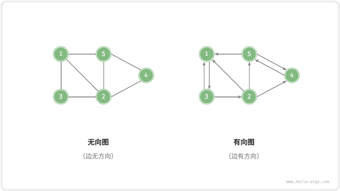
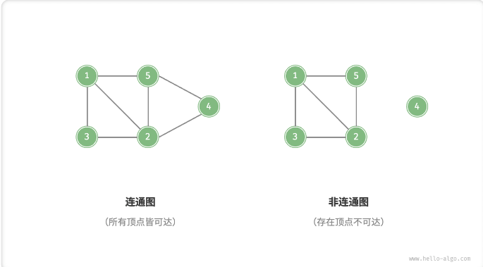
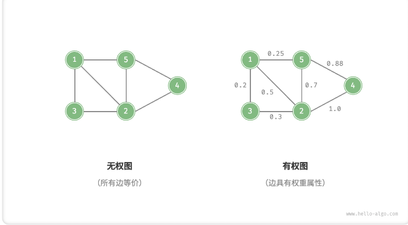
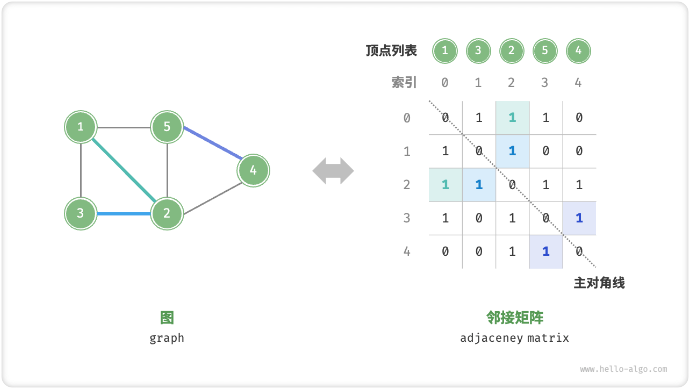
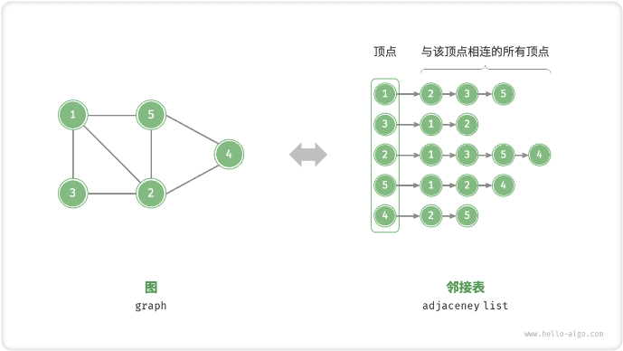

[TOC]

# 图 graph
简介：<br>
图是一种非线性数据结构，由`顶点(vertex)`和`边(dege)`组成。我们可以将图抽象地表示为一组顶点和一组边地集合。


## 图常见类型与术语

根据**边是否具有方向**，可分为`无向图(undirected graph)`和`有向图(directed graph)`。
* 在无向图中，边表示两顶点之间的“双向”连接关系 (A<->B)。
* 在有向图中，边具有方向性，即 A 和 B 两个方向的边是相互独立的。(A->B != B->A)




根据**所有顶点是否连通**，可分为`「连通图 connected graph」`和`「非连通图 disconnected graph」`
* 对于连通图，从某个顶点出发，可以到达其余任意顶点。
* 对于非连通图，从某个顶点出发，至少有一个顶点无法到达。
* 


根据**边是否有权重**，可分为`「带权图 weighted graph」`和`「无权图 unweighted graph」`
* 对于带权图，每条边都有一个权重，代表顶点之间的距离或成本。
* 对于无权图，每条边都没有权重，代表顶点之间的距离或成本都是 1。



图数据结构包含以下常用术语。

* 「邻接 adjacency」：当两顶点之间存在边相连时，称这两顶点“邻接”。
* 「路径 path」：从顶点 A 到顶点 B 经过的边构成的序列被称为从 A 到 B 的“路径”。
* 「度 degree」：一个顶点拥有的边数。对于`有向图`，「入度 in-degree」表示有多少条边指向该顶点，「出度 out-degree」表示有多少条边从该顶点指出。


## 图的表示
图的表示方式包括 `邻接矩阵` 和  `邻接表`

### 邻接矩阵
邻接矩阵使用一个 `n * n` 大小的矩阵来表示图，每一行(列)代表一个顶点，矩阵元素代表边。使用 `0` 和 `1` 表示是否相邻，或者使用一个很大的数表示权重。
设邻接矩阵为 M 、顶点列表为 V ，那么矩阵元素 M[i,j] = 1 表示顶点 V[i] 和 V[j] 之间存在边，反之 M[i,j] = 0 表示两顶点之间无边。



邻接矩阵具有一下特性：<br>
* 顶点不能与自身相连，即 M[i,i] = 0
* 对于无向图，两个方向的边等价，即 M[i,j] = M[j,i]，因此邻接矩阵一定是对称矩阵。
* 将邻接矩阵的元素从 0/1 改为权重，即可表示带权图。
* 邻接矩阵适合表示稠密图，即边数接近顶点数的平方，否则会浪费空间。<br>
使用邻接矩阵表示图时，我们可以直接访问矩阵元素以获取边。因此增删查操作效率很高，时间复杂度为`O(1)`。然而，矩阵的空间复杂度为 `O(n^2)`，内存战用较多


### 邻接表
「邻接表 adjacency list」使用` n `个链表来表示图，链表节点表示顶点。第` i `条链表对应顶点` i `，其中存储了该顶点的所有邻接顶点（即与该顶点相连的顶点）。



邻接表仅存储实际存在的边，而边的总数通常远小于 `n^2` ，因此它更加节省空间。然而，在邻接表中需要通过遍历链表来查找边，因此其时间效率不如邻接矩阵。


[leetcode 200岛屿数量](https://leetcode.cn/problems/number-of-islands/)
```java
class Solution {
    public int numIslands(char[][] grid) {
        int res = 0;
        // 遍历
        for(int i = 0; i < grid.length; i++){
            for(int j = 0; j < grid[0].length; j++){
                // 当访问到陆地进行更新(感染)
                if(grid[i][j] == '1'){
                    update(grid, i, j);
                    res++;
                }
            }
        }
        return res;
    }
    // 感染函数，将访问过的陆地变成 '2'，防止重复访问
    public void update(char[][] grid, int i, int j){
        if(i < 0 || j < 0 || i >= grid.length || j >= grid[0].length
        || grid[i][j] != '1'){
            return;
        }
        grid[i][j] = '2';
        update(grid,i,j+1);
        update(grid,i,j-1);
        update(grid,i+1,j);
        update(grid,i-1,j);

    }
}
```


## 图的操作
* 基于邻接矩阵的实现[GraphAdjMat.java](./src/GraphAdjMat.java)
* 基于邻接表的实现[GraphAdjList.java](./src/GraphAdjList.java)

## 图的遍历
图的遍历方式可分为两种：`「广度优先遍历 breadth-first traversal」`和`「深度优先遍历 depth-first traversal」`。<br>
简称 `BFS` 和 `DFS`，它们的区别在于遍历顺序不同。

### 广度优先遍历 BFS
BFS 通常借助队列来实现。队列具有“先入先出”的性质，这与 BFS 的“由近及远”的思想异曲同工<br>
1. 将遍历起始顶点 `startVet` 加入队列。并开启循环
2. 在循环的每轮迭代中，弹出队首顶点并记录访问，然后将该顶点的邻接顶点加入队列队尾
3. 循环步骤 `2` 直到队列为空
为了防止重复遍历顶点，我们需要借助一个哈希表 visited 来记录哪些节点已被访问。
[GraphAdjList.java](./src/GraphAdjList.java)


### 深度优先遍历 DFS
深度优先遍历是一种优先走到底、无路可走再回头的遍历方式<br>
“走到尽头再返回”的算法范式通常基于递归来实现。与广度优先遍历类似，在深度优先遍历中我们也需要借助一个哈希表 visited 来记录已被访问的顶点，以避免重复访问顶点。


